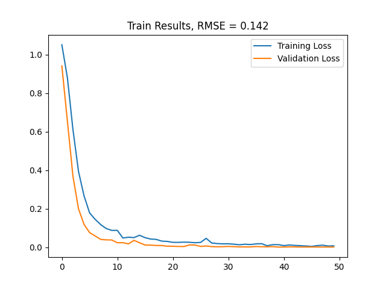

# Identify-the-speaker
This projects is a simple classification with a multilayer perceptron (MLP) on [free-spoken-digit-dataset-v1.0.8](https://www.kaggle.com/competitions/titanic/data). The MLP model consists of three layer [128, 64, 32] and optimizer of model is Adam.
## Train results
Train results with 39 feauture (13 MFCC,13 $\Delta$ MFCC, 13 $\Delta$^2 MFCC) for input are:

